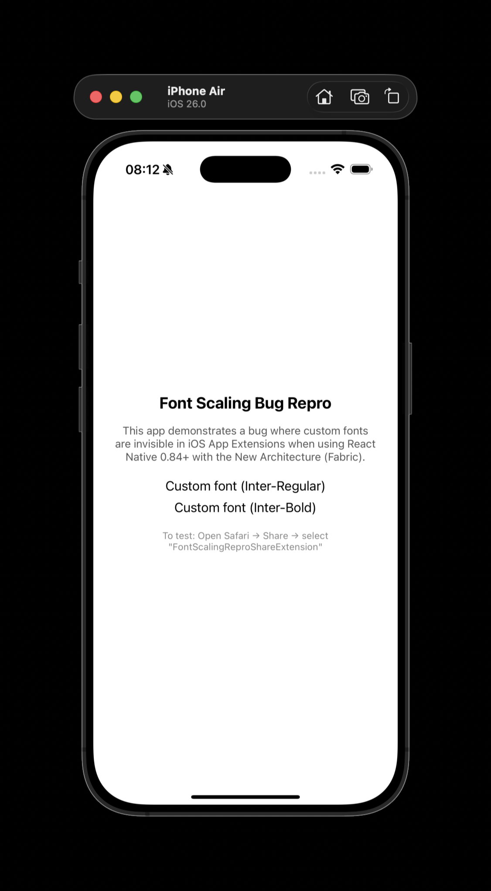
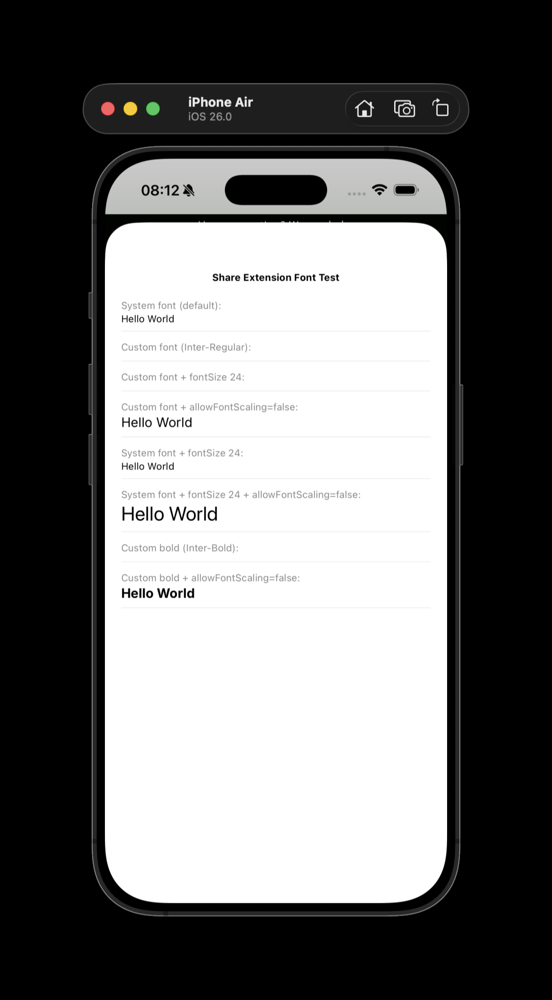

# RCTFontSizeMultiplier returns 0 in iOS App Extensions (Fabric)

Minimal reproduction for a bug where **custom font text is invisible** in iOS Share Extensions when using React Native 0.84+ with the New Architecture (Fabric).

## The Bug

`RCTFontSizeMultiplier()` in `RCTFabricSurface.mm` calls `[UIApplication sharedApplication].preferredContentSizeCategory`. In App Extensions, `sharedApplication` is `nil`, so the entire expression returns `0`. This sets `layoutContext.fontSizeMultiplier = 0`, causing all text to be measured at `fontSize * 0 = 0`.

- **System font text** still appears because `[UIFont systemFontOfSize:0]` returns a 12pt default font
- **Custom font text** is invisible because `[UIFont fontWithName:@"Inter-Regular" size:0]` returns `nil`, falling back to a zero-metrics placeholder

### Main App (fonts work)



### Share Extension (custom fonts invisible)



## Reproduction Steps

```sh
# 1. Install dependencies
npm install
cd ios && bundle install && bundle exec pod install && cd ..

# 2. Start Metro (uses port 8082 to avoid conflicts)
npm start

# 3. Build and run (in a separate terminal)
npm run ios -- --simulator 'iPhone Air'

# 4. Open Safari in the simulator, navigate to any page

# 5. Tap the Share button, select "FontScalingReproShareExtension"

# 6. Observe: system font text ("System font" lines) renders,
#    but custom font text ("Custom font Inter-Regular/Bold" lines) is invisible
```

## Expected Behavior

All text renders, including text using custom fonts registered via `UIAppFonts`.

## Actual Behavior

Text using custom `fontFamily` (e.g. `Inter-Regular`, `Inter-Bold`) is invisible in the Share Extension. The same text renders correctly in the main app.

## Root Cause

In [`React/Fabric/Surface/RCTFabricSurface.mm`](https://github.com/facebook/react-native/blob/main/packages/react-native/React/Fabric/Surface/RCTFabricSurface.mm), `_updateLayoutContext` calls:

```objc
layoutContext.fontSizeMultiplier = RCTFontSizeMultiplier();
```

And `RCTFontSizeMultiplier()` does:

```objc
return mapping[RCTSharedApplication().preferredContentSizeCategory].floatValue;
```

`RCTSharedApplication()` returns `nil` in App Extensions (by design -- `UIApplication.sharedApplication` is unavailable). Messaging `nil` returns `nil`, and `[nil floatValue]` returns `0.0`.

## Suggested Fix

Replace the `UIApplication.sharedApplication` dependency with `UITraitCollection.currentTraitCollection`, which works in App Extensions:

```objc
// Before (broken in extensions):
return mapping[RCTSharedApplication().preferredContentSizeCategory].floatValue;

// After (works everywhere):
NSString *category = RCTSharedApplication().preferredContentSizeCategory
    ?: UITraitCollection.currentTraitCollection.preferredContentSizeCategory;
return mapping[category].floatValue ?: 1.0;
```

## Environment

- React Native: 0.84.1
- React: 19.2.3
- New Architecture: enabled (Fabric + Bridgeless)
- Xcode: 17.0
- iOS Simulator: 26.0
- macOS: 26.3.1
- Custom font: [Inter](https://rsms.me/inter/) (OFL license)
